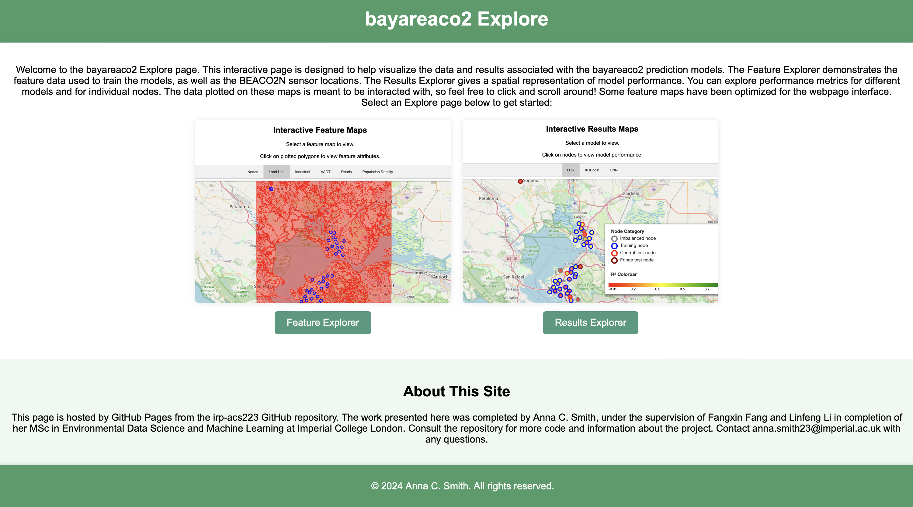
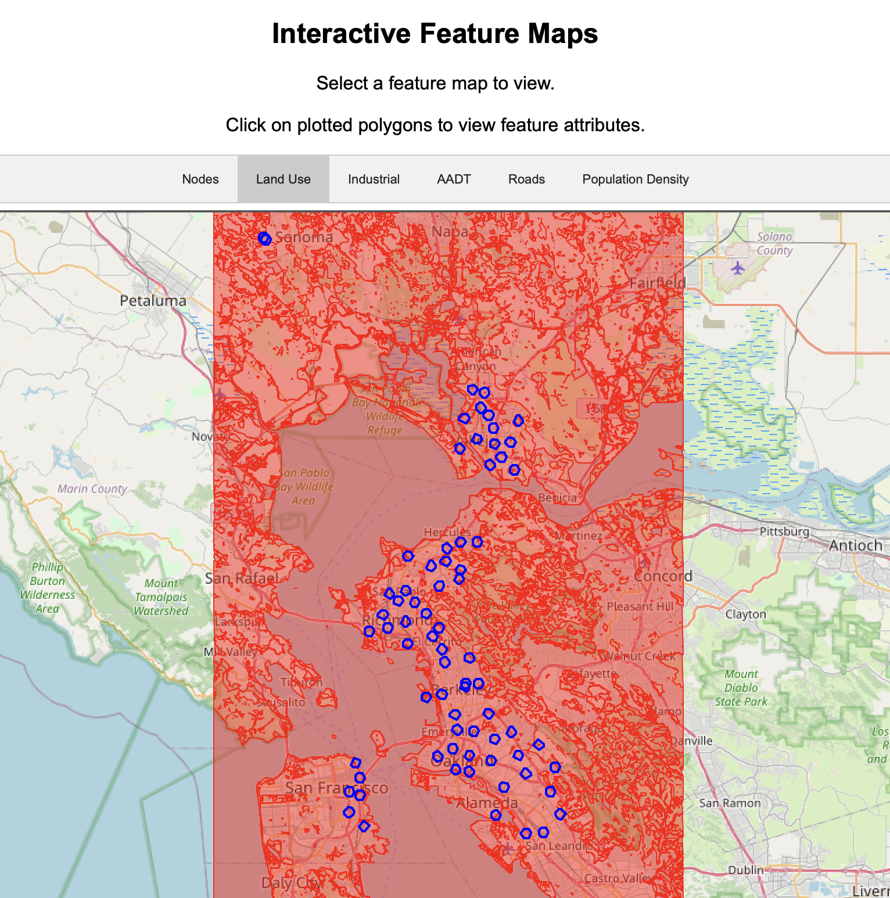
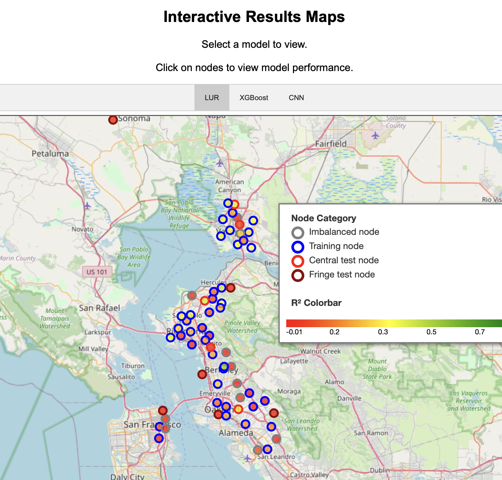

# Exploring Land Use Effects on Intraurban CO2 using Machine Learning Algorithms for Urban Decarbonization

**Imperial College London**  
Department of Earth Science and Engineering  
MSc Environmental Data Science and Machine Learning

**Independent Research Project**  
September 2024

**by Anna C. Smith**  
anna.smith23@imperial.ac.uk

**Supervisors:**  
Fangxin Fang, Linfeng Li, Jiansheng Xiang

## Table of Contents
1. [Introduction](#intro)
2. [Installation](#install)
3. [Repository Overview](#repo)
4. [bayareaco2 Explore](#explore)
5. [Documentation](#docs)
6. [License](#license)

<a name="intro"></a>

## Introduction

"**ABSTRACT**
Carbon dioxide (CO2) is a key driver of anthropogenic climate change, and cities have been identified as major sources of emissions. Both urbanization and land use change are positively correlated with rising CO2 emissions, highlighting the need to study spatiotemporal trends in CO2 to better inform sustainable city planning and urban decarbonization strategies. This study is the first to investigate the viability of using land use regression (LUR) to predict intraurban CO2 concentrations in the San Francisco Bay Area using data from the BEACO2N monitoring network. Furthermore, LUR is compared to machine learning (ML) and deep learning (DL) algorithms that explore non-linear relationships, representing a two-fold novel contribution to the literature. Model performance is evaluated using reserved data from training CO2 sensors, as well as data from unseen sensor locations. The highest predictive accuracy is achieved using extreme gradient boosting (XGBoost) and a convolutional neural network (CNN), both with R² values of 0.58, outperforming traditional LUR, which achieved an R² of 0.34. XGBoost and CNN also outperformed traditional LUR for unseen sensor locations, accounting for up to 42% of the variability in observed CO2 concentrations. The performance of the models is constrained by the inconsistent validity of the CO2 data, as well as the limited availability of environmental feature data with fine temporal resolution." - [`acs223-final-report.pdf`](deliverables/acs223-final-report.pdf)

This GitHub repository contains the coding analysis and machine learning modelling to accompany the Independent Research Project submission. This work was performed by Anna C. Smith in completion of the MSc in Environmental Science and Machine Learning at Imperial College London. 


<a name="install"></a>

## Installation

### **Cloning the GitHub repository**

Navigate to your desired directory in the terminal and run:

```zsh
git clone https://github.com/ese-msc-2023/irp-acs223.git
```

This will create a local copy of the repository on your machine.

### **Creating the `co2` conda environment**

Move into the newly cloned directory by running:
```bash
cd irp-acs223
```

Use the provided environment file to create a new Conda environment:
```bash
conda env create -f environment.yml
```

Once the environment has been created, activate it with:
```bash
conda activate co2
```

### **Installing `bayareaco2` module**
With the environment activated and from the root of the cloned directory, install the bayareaco2 module in editable mode:
```bash
pip install -e .
```

<a name="repo"></a>

## Repository Overview
The `irp-acs223` repository contains a few important directories:

### [bayareaco2](bayareaco2)
The `bayareco2` directory contains the content of the `bayareaco2` module. 


**[`bayareco2/preprocessing`](bayareaco2/preprocessing)** includes the `features.py` script that is used to handle GeoDataFrames and to overlay and extract data using CO2 node data and raw feature data.

**[`bayareco2/models`](bayareaco2/models)** features four Python scripts are used to import feature and target variable data, and to train and evaluate the three prediction models.

**[`bayareco2/notebooks`](bayareaco2/notebooks)** contains all the Jupyter notebooks used to preprocess raw data, and to train and evaluate prediction models. 

- The [`preprocessing`](bayareaco2/notebooks/preprocessing/) folder contains several notebooks demonstrating exploratory data analysis and data preprocessing. Note that these notebooks notebooks can only be run locally after downloading the necessary raw data files. For more information, consult [Data/README.md](Data/README.md).

- The [`training`](bayareaco2/notebooks/training/) notebooks help document the process of tuning hyperparameters and optimizing prediction models. Note that the models and approaches featured in [Literature_LUR.ipynb](bayareaco2/notebooks/training/Literature_LUR.ipynb) and [reshaped_CNN_attempt.ipynb](bayareaco2/notebooks/training/reshaped_CNN_attempt.ipynb) were not ultimately used to generate results.

- The results discussed in the final report were generated and can be viewed in the [`results`](bayareaco2/notebooks/results/) notebooks.

**[`bayareco2/explore`](bayareaco2/explore)** contains the `.html` files used to create the interactive maps that showcase the data and model performances.

**[`bayareco2/tests`](bayareaco2/tests)** contains tests that ensure proper module functionality using pytest. To run tests, run the following command in the root directory after activating the `co2` conda environment:

```bash
pytest
```

### [Data](Data)
The `Data` directory contains `.csv` files necessary to run the model training and results notebooks. Refer to the [Data/README.md](Data/README.md) for more information about data access.

### [deliverables](deliverables)
The `deliverables` folder contains the `.pdf`  project deliverables, including the project plan, final report, and presentation.


<a name="explore"></a>

## bayareaco2 Explore

The [bayareaco2 Explore](https://ese-msc-2023.github.io/irp-acs223/) page was created as an interactive webpage hosted my GitHub pages to further showcase the data used in this project, as well as model performance.

[](https://ese-msc-2023.github.io/irp-acs223/)


 Here you can find the [Feature Explorer](https://ese-msc-2023.github.io/irp-acs223/feature_explorer.html), which includes interactive maps that show the raw feature datasets alongside CO2 monitoring nodes and surrounding buffer areas used to extract feature data. 

[](https://ese-msc-2023.github.io/irp-acs223/feature_explorer.html)

 The [Results Explorer](https://ese-msc-2023.github.io/irp-acs223/feature_explorer.html) features three maps, one for each model, which demonstrate model performance across different node locations in the BEACO2N monitoring network.

 [](https://ese-msc-2023.github.io/irp-acs223/results_explorer.html)


<a name="docs"></a>

## Documentation

Documentation for the `bayareaco2` module is provided using Sphinx. Upon cloning the repository and installing all requirements, you are ready to generate and explore the documentation. From the `irp-acs223` root directory, follow these steps:

Navigate to the `docs` directory:
```bash
cd docs
```

Build the html documentation:
```bash
make html
```
Open and view the documentaiton generated in the `_build/html` directory:
```bash
open _build/html/index.html  
```


<a name="license"></a>

## License

This project is licensed under the MIT License - see [**LICENSE.md**](LICENSE.md)
